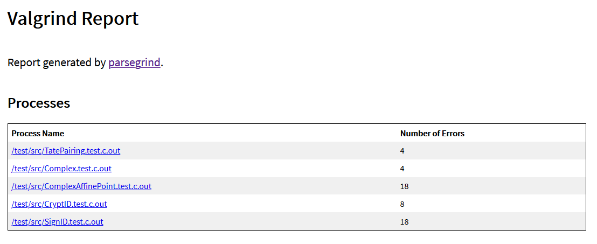
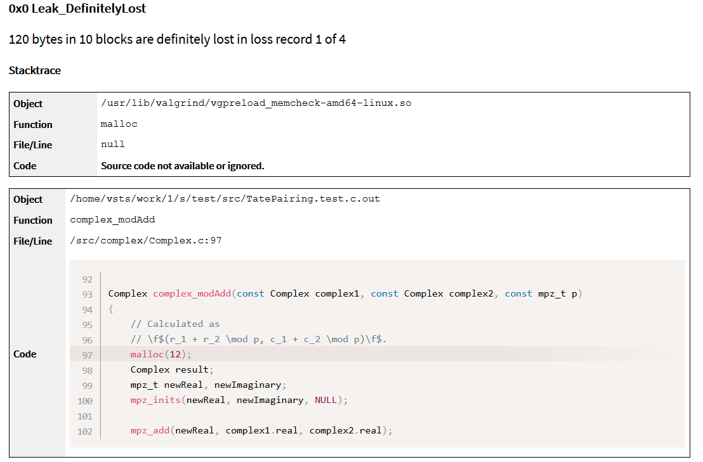

# Parsegrind

Parsegrind takes the XML output of valgrind and produces a human-readable single-page HTML report.

Can be used either as a CLI or a library included in your own tool.

## CLI

First download the latest release from the [GitHub Releases](https://github.com/cryptid-org/parsegrind/releases) page.

Afterwards, execute it using `java -jar`:

~~~~
$ java -jar parsegrind-cli-1.1.3.jar
Missing required options [--source-glob=<sourceGlobs>, --valgrind-glob=<xmlGlobs>, --output=<outputFile>]
Usage: parsegrind [-hV] [--base-directory=<baseDirectory>]
                  [--lines-after=<linesAfter>] [--lines-before=<linesBefore>]
                  -o=<outputFile> [--repository-base-link=<repositoryBaseLink>]
                  --source-glob=<sourceGlobs> [--source-glob=<sourceGlobs>]...
                  --valgrind-glob=<xmlGlobs> [--valgrind-glob=<xmlGlobs>]...
      --base-directory=<baseDirectory>
                  The workspace directory. When omitted, the current directory
                    will be used.
  -h, --help      Show this help message and exit.
      --lines-after=<linesAfter>
                  Number of lines to output after an offending line.
      --lines-before=<linesBefore>
                  Number of lines to output before an offending line.
  -o, --output=<outputFile>
                  Output file into which the rendered report is written.
      --repository-base-link=<repositoryBaseLink>
                  Base repository link (for example, GitHub) to which the file
                    paths will be relativized to.
      --source-glob=<sourceGlobs>
                  Glob pattern to use when matching source files.
  -V, --version   Print version information and exit.
      --valgrind-glob=<xmlGlobs>
                  Glob pattern to use when matching valgrind output files.
~~~~

### Example Output

**Preamble**

**Memory Leak and Stacktrace**

### Example Usage

Parsegrind is used for example in [CryptID.native](https://github.com/cryptid-org/cryptid-native)'s Azure Pipelines workflow as follows:

~~~~
java -jar parsegrind.jar \
    --base-directory=../ \
    --source-glob=**/*.c \
    --valgrind-glob=**/*.memcheck.xml \
    --output=../memcheck.html
~~~~

## Library

### Add Dependency

Developing against the Parsegrind Library first starts with adding it as a dependency. Because Parsegrind is deployed to the GitHub package registry, you first need to add the appropriate repository to your POM:

~~~~xml
<repository>
  <id>github-cryptid-parsegrind</id>
  <name>GitHub CryptID Parsegrind Apache Maven Packages</name>
  <url>https://maven.pkg.github.com/cryptid-org/parsegrind</url>
</repository>
~~~~

Afterwards, the appropriate dependency can be added:

~~~~xml
<dependency>
  <groupId>cryptid</groupId>
  <artifactId>parsegrind-lib</artifactId>
  <version>1.1.3</version>
<dependency>
~~~~

### Example Usage

~~~~java
import cryptid.parsegrind.Configuration;
import cryptid.parsegrind.Parsegrind;
import cryptid.parsegrind.valgrind.model.ValgrindReport;

import java.io.IOException;

public class Example {
    public void renderToHtml() throws IOException {
        Configuration configuration = Configuration.builder()
                /* Configure the same options as for the CLI. */
                .build();

        Parsegrind parsegrind = Parsegrind.fromConfiguration(configuration);

        ValgrindReport report = parsegrind.parse();

        String htmlDocument = parsegrind.render(report);
    }
}
~~~~

## License

Parsegrind is based on the [Jenkins CI Valgrind Plugin](https://github.com/jenkinsci/valgrind-plugin) (MIT licensed).

Parsegrind is available under The MIT License (see [LICENSE](LICENSE) for more information).
